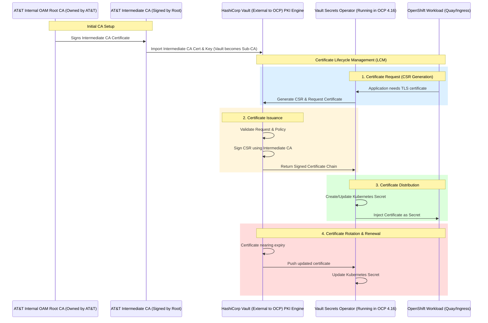

# mermaid-diagrams

## Certificate Lifecycle Management with HashiCorp Vault

This diagram illustrates the certificate lifecycle management process using HashiCorp Vault as a subordinate CA under AT&T's internal OAM Root CA, integrated with OpenShift via the Vault Secrets Operator.

### Mermaid Diagram



## Authentication and LDAP Integration Flow

This diagram illustrates how OpenShift handles user authentication with LDAP/Active Directory and manages authorization through group synchronization.

### Mermaid Diagram

```mermaid
flowchart TD
  subgraph Login_Flow["User Login (Authentication)"]
    A[User requests login to OpenShift (Web or CLI)]
    B[OpenShift OAuth Server receives credentials]
    C[OAuth Server initiates LDAP authentication]
    D[LDAP/AD receives credential check]
    E{LDAP user account status?}
    F[Credentials valid]
    G[Credentials invalid / account disabled]
    H[Login successful - session created]
    I[Login failed - access denied]
    A --> B --> C --> D --> E
    E -- valid --> F --> H
    E -- invalid/disabled --> G --> I
  end

  subgraph AuthZ_Flow["Authorization (Access Control)"]
    J[User session requests action in OpenShift]
    K[OpenShift checks user's group memberships]
    L[Groups mapped from last synced LDAP (group sync)]
    M[Authorization evaluated against OpenShift Roles]
    N{Has required group/role?}
    O[Action permitted]
    P[Action denied]
    J --> K --> L --> M --> N
    N -- yes --> O
    N -- no --> P
  end

  %% Between syncs section
  subgraph Sync_Lag["LDAP <-> OCP Group Sync (cadence)"]
    Q[Group membership changes in LDAP]
    R[Group Sync runs on schedule (e.g., every 15 min)]
    S[OpenShift group objects updated]
    Q --> R --> S
    S --> L
  end

  %% Relate session creation to authZ
  H -.-> J
```

### How to View Rendered Mermaid Diagrams

GitHub automatically renders Mermaid diagrams in Markdown files. To view the rendered diagram:

1. **In the GitHub UI**: Simply view this README.md file in GitHub's web interface. The diagram will be automatically rendered.
2. **Click on the diagram**: You can click on the rendered diagram to see it in a larger view.
3. **Edit mode preview**: When editing, click the "Preview" tab above the editor to see the rendered diagram.

Mermaid syntax is fully supported in GitHub-flavored Markdown, making it easy to create and maintain complex diagrams directly in your documentation.
