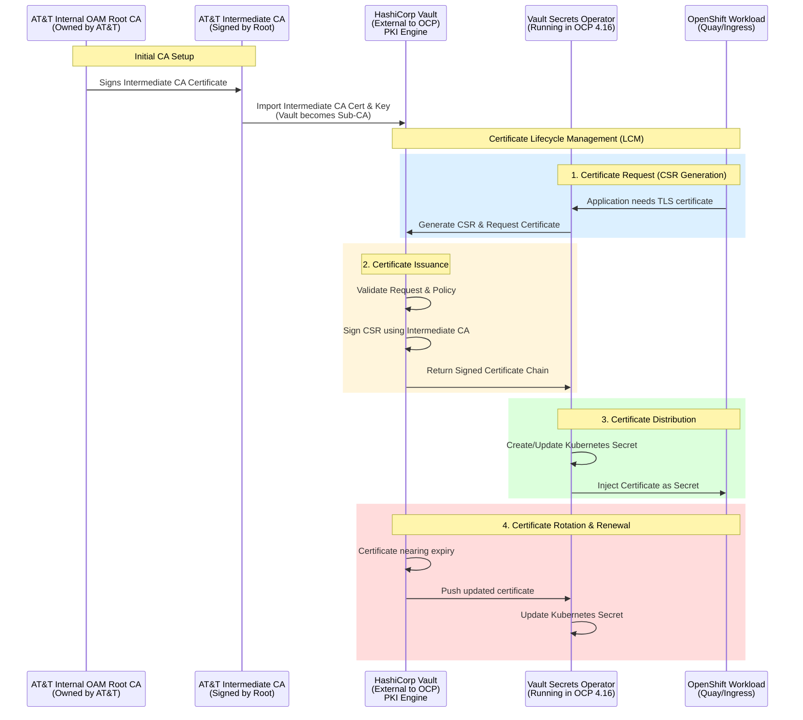

# AT&T OAM Vault PKI Certificate Lifecycle

```mermaid
sequenceDiagram
  participant ATT_ROOT as AT&T Internal OAM Root CA<br/>(Owned by AT&T)
  participant ATT_INT as AT&T Intermediate CA<br/>(Signed by Root)
  participant VAULT as HashiCorp Vault<br/>(External to OCP)<br/>PKI Engine
  participant VSO as Vault Secrets Operator<br>(Running in OCP 4.16)
  participant WORKLOAD as OpenShift Workload<br>(Quay/Ingress)


  Note over ATT_ROOT, ATT_INT: Initial CA Setup
  ATT_ROOT ->> ATT_INT: Signs Intermediate CA Certificate
  ATT_INT ->> VAULT: Import Intermediate CA Cert & Key<br/>(Vault becomes Sub-CA)
  Note over VAULT, WORKLOAD: Certificate Lifecycle Management (LCM)
  rect rgb(220, 240, 255)
    Note over WORKLOAD, VSO: 1. Certificate Request (CSR Generation)
    WORKLOAD ->> VSO: Application needs TLS certificate
    VSO ->> VAULT: Generate CSR & Request Certificate
  end
  rect rgb(255, 245, 220)
    Note over VAULT: 2. Certificate Issuance
    VAULT ->> VAULT: Validate Request & Policy
    VAULT ->> VAULT: Sign CSR using Intermediate CA
    VAULT ->> VSO: Return Signed Certificate Chain<br/>
  end
  rect rgb(220, 255, 220)
    Note over VSO, WORKLOAD: 3. Certificate Distribution
    VSO ->> VSO: Create/Update Kubernetes Secret
    VSO ->> WORKLOAD: Inject Certificate as Secret
    
  end
  rect rgb(255, 220, 220)
    Note over VAULT, WORKLOAD: 4. Certificate Rotation & Renewal
    VAULT ->> VAULT: Certificate nearing expiry
    VAULT ->> VSO: Push updated certificate
    VSO ->> VSO: Update Kubernetes Secret


  end
```
